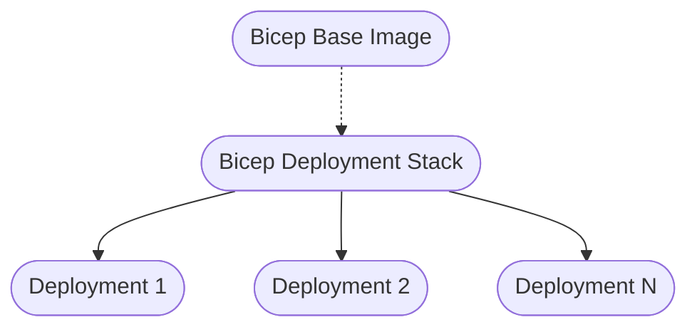

## Table of Contents
- [Overview](#overview)
- [Prerequisites](#prerequisites)
  - [Components](#components)
    - [1. Azure Subscription](#1-azure-subscription)
    - [2. GitLab Runner](#2-gitlab-runner)
    - [3. Docker Image with Tooling](#3-docker-image-with-tooling)
    - [4. Stack Repository](#4-stack-repository)
    - [5. Inheritable Pipeline Definition](#5-inheritable-pipeline-definition)
    - [6. Stack Versioning](#6-stack-versioning)
  - [Steps](#steps)
- [Example Usage](#example-usage)
- [Architecture](#architecture)
  - [Dockerfile](#dockerfile)
- [Bicep Deployment](#bicep-deployment)
- [Related Links](#related-links)

# Overview

This guide describes a scalable Bicep Deployment Stack designed for efficient infrastructure deployment using Bicep, Azrue Deployment Stacks, and GitLab pipelines. The solution is modular and reusable, following best practices for Infrastructure as Code (IaC).


# Prerequisites

Before you begin, ensure you have the following:

- An active Azure subscription
- Access to a GitLab instance (self-hosted or gitlab.com)
- Docker installed on your local machine or CI environment
- Basic knowledge of Bicep, Azure Resource Manager (ARM), and CI/CD concepts
- Visual Studio Code
  
## Components

The stack consists of the following components:

### 1. Azure Subscription
- You need one or more Azure Subscription (e.b Dev, Test, Prod). 

###  2. GitLab Runner 
- You have to add contributor permission to your GitLab runner or multiple runners for each environment. In my case a use one App Registration for one Subscripton. In a large scale I recommend to yous a Kubernets Cluster with Managed Identities for each subscripton.

### 3. Docker Image with Tooling
- Contains all required tools: Bicep CLI, Azure CLI, PowerShell, and supporting scripts
- Ensures consistent build and deployment environments across projects
- Located in the `bicep-base-image` directory

### 4. Stack Repository
- Central repository for pipeline definitions and stack versioning
- Houses the `bice.gitlab-ci.yml` file, which defines the CI/CD pipeline
- Enables version control and traceability for stack changes

### 5. Inheritable Pipeline Definition
- The `bice.gitlab-ci.yml` pipeline is designed to be inherited by multiple projects
- Example: The `bicep-virtualmachine-deployment` project can reuse the same pipeline definition for consistent deployments
- Promotes DRY (Don't Repeat Yourself) principles and simplifies maintenance

### 6. Stack Versioning
- Each deployment stack is versioned, allowing for controlled rollouts and easy rollbacks
- Versioning is managed within the stack repository

## Steps

1. Create an Azure Subscriptiont
2. Create a App Registration with a Client Secret. Add a Role Assignment with `Contributor` to your Subscription
3. Add the following the GitLab variable on your `bicep-deployment-stack`:
    - AZURE_TENANT_ID
    - AZURE_SUBSCRIPTION_ID
    - AZURE_APPLICATION_ID
    - AZURE_CLIENT_SECRET (Masked)

# Example Usage

To use the Bicep Deployment Stack in a new project:

1. Reference the `bice.gitlab-ci.yml` in your project's `.gitlab-ci.yml`:
   ```yaml
   include:
     - project: 'your-group/bicep-deployment-stack'
       file: '/bice.gitlab-ci.yml'
   ```
2. Place your Bicep files and parameters in your project repository (e.g., `bicep-virtualmachine-deployment`)
3. Push your changes to GitLab to trigger the pipeline

# Architecture



## Dockerfile

This is an example how the base image for your bicep deployment stack could look like. It can also used for the vscode devcontainer.

```dockerfile
FROM mcr.microsoft.com/azure-powershell:14.0.0-ubuntu-22.04

RUN apt-get update && \
    apt-get upgrade -y && \
    apt-get -y install curl && \
    apt-get clean && \
    rm -rf /var/lib/apt/lists/*

LABEL maintainer="services@webflow.ch"

ARG BICEP_VERSION="0.35.1"
# ARG AZ_RESOURCES_VERSION="7.7.0"

RUN curl -Lo bicep "https://github.com/Azure/bicep/releases/download/v${BICEP_VERSION}/bicep-linux-x64" && \
    chmod +x ./bicep  && \
    mv ./bicep /usr/local/bin/bicep && \
    apt-get update

# Install specific powershell modules
# RUN pwsh -Command "Set-PSRepository -Name PSGallery -InstallationPolicy Trusted; \
#     Install-Module -Name Az.Resources -RequiredVersion '${AZ_RESOURCES_VERSION}' \
#     -Scope AllUsers -Verbose -Force"

COPY scripts/ /usr/local/bin

# It is not recommended to use the root user
USER root 

## Bicep Deployment Stack 
### Pipeline definitions


```yaml
# .gitlab-ci.yml
workflow:
  rules:
    - if: $CI_COMMIT_BRANCH == $CI_DEFAULT_BRANCH
    - if: $CI_MERGE_REQUEST_IID
    - if: $CI_COMMIT_TAG

stages:
  - Publish

variables:
  VERSION: "1.0.${CI_PIPELINE_IID}"

gitlab:release:
  stage: Publish
  image: registry.gitlab.com/gitlab-org/release-cli
  script: 
    - echo "Create release"
  release:
    name: 'bicep-deployment-stack'
    description: 'Release for Bicep deployment stack'
    tag_name: $VERSION
  rules:
    - if: $CI_COMMIT_BRANCH == $CI_DEFAULT_BRANCH
```

```yaml
# bicep.gitlab-ci.yml
image: webflowch/bicep-deployment-image:1.2

workflow:
  rules:
    - if: $CI_COMMIT_BRANCH == $CI_DEFAULT_BRANCH
    - if: $CI_MERGE_REQUEST_IID
    - if: $CI_COMMIT_TAG

stages:
  - build
  - test
  - deploy

variables:
  LOCATION: 'westeurope'
  STAGE: 'prod'

bicep-lint:
  stage: build
  script:
    - echo "Linting Bicep files..."
    - pwsh -Command "Lint-Bicep.ps1 -Path './src' -Recurse"
  rules:
    - if: $CI_COMMIT_BRANCH
      when: always
    - if: $CI_MERGE_REQUEST_ID

build-bicep:
  stage: build
  script:
    - echo "Building Bicep files..."
    - pwsh -Command "Build-Bicep.ps1 -File './src/main.bicep' -ParamFile './config/main-${STAGE}-${LOCATION}.bicepparam' -OutPath './artifacts'"
  artifacts:
    paths:
      - ./artifacts
    expire_in: 1 hour
    when: on_success
  rules:
    - if: $CI_COMMIT_BRANCH
      when: always
    - if: $CI_MERGE_REQUEST_ID

deploy-test:
  stage: deploy
  before_script:
    - echo "Login to Azure..."
    - pwsh -Command "Connect-Azure.ps1 -TenantId ${AZURE_TENANT_ID} -SubscriptionId ${AZURE_SUBSCRIPTION_ID} -ApplicationId ${AZURE_APPLICATION_ID} -ClientSecret (ConvertTo-SecureString ${AZURE_CLIENT_SECRET} -AsPlainText -Force) -UseServicePrincipal"
  script:
    - echo "Deploying to test environment..."
    - pwsh -Command "Deploy-Bicep.ps1 -DeploymentName 'bicep-deployment-stack' -TemplateFile './artifacts/main.json' -TemplateParameterFile './artifacts/main-${STAGE}-${LOCATION}.parameters.json' -Location '${LOCATION}' -Test"
  needs:
    - bicep-lint
    - build-bicep
  rules:
    - if: $CI_COMMIT_BRANCH == $CI_DEFAULT_BRANCH

deploy:
  stage: deploy
  before_script:
    - echo "Login to Azure..."
    - pwsh -Command "Connect-Azure.ps1 -TenantId ${AZURE_TENANT_ID} -SubscriptionId ${AZURE_SUBSCRIPTION_ID} -ApplicationId ${AZURE_APPLICATION_ID} -ClientSecret (ConvertTo-SecureString ${AZURE_CLIENT_SECRET} -AsPlainText -Force) -UseServicePrincipal"
  script:
    - echo "Deploying to production environment..."
    - pwsh -Command "Deploy-Bicep.ps1 -DeploymentName 'bicep-deplyoment-stack' -TemplateFile './artifacts/main.json' -TemplateParameterFile './artifacts/main-${STAGE}-${LOCATION}.parameters.json' -Location '${LOCATION}'
  needs:
    - deploy-test
    - build-bicep
  rules:
    - if: $CI_COMMIT_BRANCH == $CI_DEFAULT_BRANCH

```

# Bicep Deployment

Just include the `bicep.gitlab-ci.yml` file in your project with the correct version `ref`.

```yaml
include: 
  - project: 'webflow-development/bicep/bicep-deployment-stack'
    file: 'bicep.gitlab-ci.yml'
    ref: '1.0.41'
```

Here is the file structure needed for the Bicep deployment stack.

```tree
│   .gitignore
│   .gitlab-ci.yml
│   README.md
├───.devcontainer
│       devcontainer.json
├───config
│       main-dev-westeurope.bicepparam
│       main-prod-westeurope.bicepparam
│       main-test-westeurope.bicepparam
└───src
    │   main.bicep
    │
    └───modules
            tags.bicep
            virtualmachine.bicep
```
# Related Links

- [Bicep Documentation](https://learn.microsoft.com/en-us/azure/azure-resource-manager/bicep/overview)
- [Azure Documentation](https://learn.microsoft.com/en-us/azure/)
- [GitLab CI/CD Documentation](https://docs.gitlab.com/ee/ci/)
- [Docker Documentation](https://docs.docker.com/)
- [Infrastructure as Code (IaC) Concepts](https://learn.microsoft.com/en-us/devops/deliver/what-is-infrastructure-as-code)

---

For more details or questions, feel free to reach out or open an issue in the repository.

